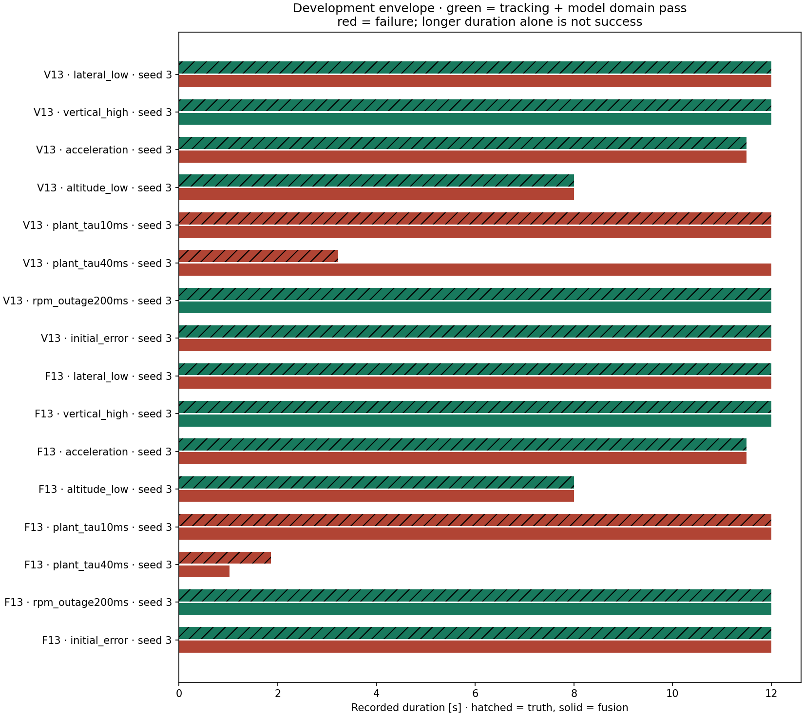
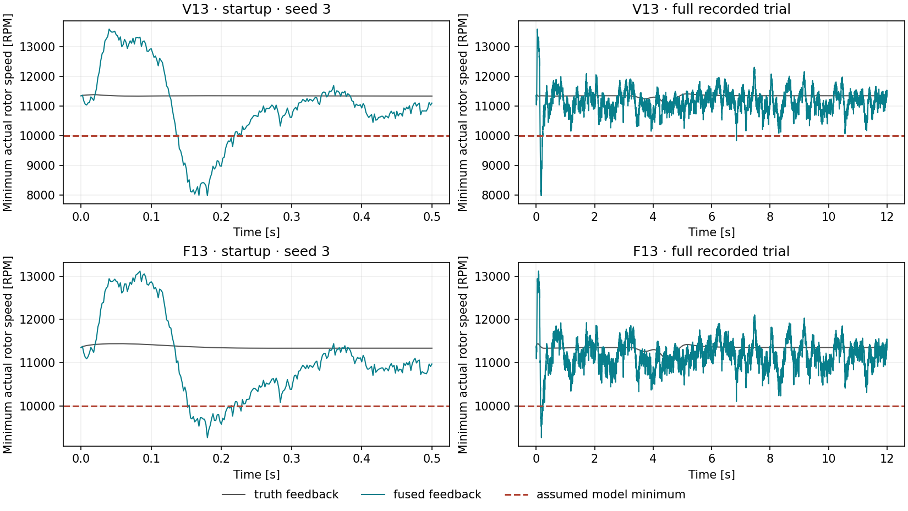

# Paired sensor envelope development screen

**Fixed gains; development seeds; not final tuning or paper evidence.**

Each fused-feedback run is paired with the same controller, physical scenario and acceptance thresholds under truth feedback. Deterministic truth controls are shared across sensor-only variants and seeds; those shared controls are not independent repeats. The observer assumes 20 ms throughout. Physical motor perturbations change the plant only. All other sensor settings retain the v9 candidate, including steady-trim rotor prehistory.

Track/domain columns show separate verdicts. Full pass requires both. An early-stop RMSE covers only the recorded prefix and must not rank above a full trial on that basis. Truth failure prevents attributing the corresponding failure solely to sensing. The original paper criteria and failure reasons are also retained in the JSON.

| Controller | Condition | Seed | Truth track/domain | Fusion track/domain | Duration truth/fusion [s] | Fusion z / v RMSE | Pair outcome |
|---|---|---:|---|---|---|---|---|
| V13 | lateral_low | 3 | True / True | True / False | 12.000 / 12.000 | 0.078 / 0.263 | fusion_only_failure |
| V13 | vertical_high | 3 | True / True | True / True | 12.000 / 12.000 | 0.068 / 0.163 | both_pass |
| V13 | acceleration | 3 | True / True | True / False | 11.500 / 11.500 | 0.078 / 0.134 | fusion_only_failure |
| V13 | altitude_low | 3 | True / True | True / False | 8.000 / 8.000 | 0.099 / 0.293 | fusion_only_failure |
| V13 | plant_tau10ms | 3 | True / False | False / False | 12.000 / 12.000 | 6.426 / 32.219 | both_fail |
| V13 | plant_tau40ms | 3 | False / False | False / False | 3.220 / 12.000 | 2.470 / 26.304 | both_fail |
| V13 | rpm_outage200ms | 3 | True / True | True / True | 12.000 / 12.000 | 0.070 / 0.336 | both_pass |
| V13 | initial_error | 3 | True / True | True / False | 12.000 / 12.000 | 0.068 / 0.336 | fusion_only_failure |
| F13 | lateral_low | 3 | True / True | True / False | 12.000 / 12.000 | 0.084 / 0.262 | fusion_only_failure |
| F13 | vertical_high | 3 | True / True | True / True | 12.000 / 12.000 | 0.070 / 0.155 | both_pass |
| F13 | acceleration | 3 | True / True | True / False | 11.500 / 11.500 | 0.071 / 0.224 | fusion_only_failure |
| F13 | altitude_low | 3 | True / True | True / False | 8.000 / 8.000 | 0.100 / 0.294 | fusion_only_failure |
| F13 | plant_tau10ms | 3 | True / False | True / False | 12.000 / 12.000 | 0.287 / 1.733 | both_fail |
| F13 | plant_tau40ms | 3 | False / False | False / False | 1.860 / 1.020 | 0.090 / 1.853 | both_fail |
| F13 | rpm_outage200ms | 3 | True / True | True / True | 12.000 / 12.000 | 0.071 / 0.332 | both_pass |
| F13 | initial_error | 3 | True / True | False / False | 12.000 / 12.000 | 0.455 / 5.126 | fusion_only_failure |

## Rotor availability

Readiness is an age/availability diagnostic. The current controller keeps operating while it is false; this is not a validated fallback policy.

| Controller | Condition | Seed | Physical / observer tau [ms] | Max sample age [ms] | Not-ready time [s] | Allocations while not ready |
|---|---|---:|---|---:|---:|---:|
| V13 | lateral_low | 3 | 20.000 / 20.000 | 4.000 | 0.000 | 0 |
| V13 | vertical_high | 3 | 20.000 / 20.000 | 4.000 | 0.000 | 0 |
| V13 | acceleration | 3 | 20.000 / 20.000 | 4.000 | 0.000 | 0 |
| V13 | altitude_low | 3 | 20.000 / 20.000 | 4.000 | 0.000 | 0 |
| V13 | plant_tau10ms | 3 | 10.000 / 20.000 | 4.000 | 0.000 | 0 |
| V13 | plant_tau40ms | 3 | 40.000 / 20.000 | 4.000 | 0.000 | 0 |
| V13 | rpm_outage200ms | 3 | 20.000 / 20.000 | 204.000 | 0.154 | 77 |
| V13 | initial_error | 3 | 20.000 / 20.000 | 4.000 | 0.000 | 0 |
| F13 | lateral_low | 3 | 20.000 / 20.000 | 4.000 | 0.000 | 0 |
| F13 | vertical_high | 3 | 20.000 / 20.000 | 4.000 | 0.000 | 0 |
| F13 | acceleration | 3 | 20.000 / 20.000 | 4.000 | 0.000 | 0 |
| F13 | altitude_low | 3 | 20.000 / 20.000 | 4.000 | 0.000 | 0 |
| F13 | plant_tau10ms | 3 | 10.000 / 20.000 | 4.000 | 0.000 | 0 |
| F13 | plant_tau40ms | 3 | 40.000 / 20.000 | 4.000 | 0.000 | 0 |
| F13 | rpm_outage200ms | 3 | 20.000 / 20.000 | 204.000 | 0.154 | 77 |
| F13 | initial_error | 3 | 20.000 / 20.000 | 4.000 | 0.000 | 0 |

The JSON embeds source hashes, deduplicated full configurations, all trial verdicts, pair identities, and relative local trace paths. Missing-output and timed-out trials remain in the record. Raw traces are kept locally. Use the recorded condition/seed axes to reproduce into a new output directory.

## Low-speed propulsion-domain boundary

Minimum actual rotor speed across all four rotors, from the saved plant traces. The horizontal line is the unchanged assumed lower propeller-data boundary. This plot diagnoses a model-domain crossing; it does not establish hardware instability.

