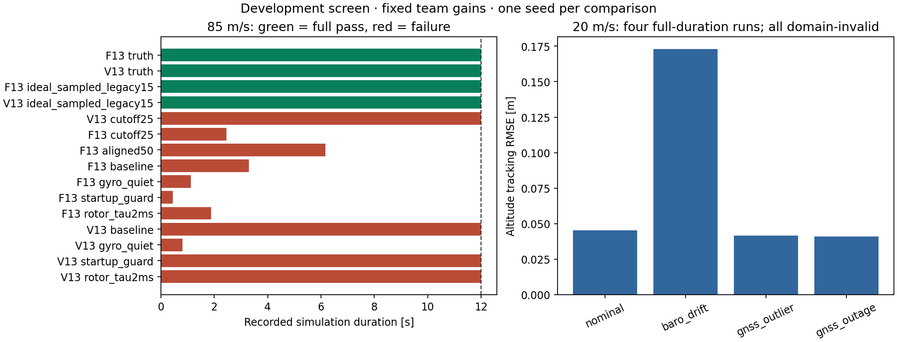

# Sensor readiness and controller matching — v7

**Development results only. The sensor candidate is not ready for final paper experiments.**

All v7 runs use Python 3.13.7, the five exact pinned dependency versions, and one thread per numeric library. The fitted controller-model coefficients and candidate configuration hash match the team reference. The original truth configuration, aircraft, controller gains, and controller defaults were not changed.

Software verification: **230 tests passed, 8 long legacy tests skipped, 0 failed**. Code tests establish implementation behavior, not control robustness. The full Git/tag setup check is not claimed.

## Matched high-speed comparison

85 m/s lateral-gust case, development seed 3 for sensor runs. Variants change one specified parameter; `aligned50` changes F13 S0 to S1. The ideal sampled reference uses the existing ideal profile and legacy 15D filter; it is a separate interface reference, not a one-factor joint-filter ablation.

| Controller | Feedback / variant | Duration [s] | Tracking | Model domain | z RMSE [m] | v RMSE [m/s] | Solver failures |
|---|---|---:|---|---|---:|---:|---:|
| V13 | rotor_tau2ms | 12.000 | False | False | 5.319 | 30.979 | 8 |
| V13 | startup_guard | 12.000 | False | False | 4.752 | 29.233 | 4 |
| V13 | gyro_quiet | 0.810 | False | False | 0.578 | 7.206 | 0 |
| V13 | baseline | 12.000 | False | False | 10.635 | 34.869 | 9 |
| F13 | rotor_tau2ms | 1.880 | False | False | 0.943 | 5.872 | 7 |
| F13 | startup_guard | 0.440 | False | False | 0.670 | 5.460 | 7 |
| F13 | gyro_quiet | 1.120 | False | False | 0.173 | 2.187 | 9 |
| F13 | baseline | 3.300 | False | False | 1.055 | 9.890 | 19 |
| F13 | aligned50 | 6.160 | False | False | 0.986 | 9.059 | 25 |
| F13 | cutoff25 | 2.460 | False | False | 0.487 | 6.175 | 8 |
| V13 | cutoff25 | 12.000 | False | False | 4.729 | 29.895 | 4 |
| V13 | ideal_sampled_legacy15 | 12.000 | True | True | 0.017 | 0.325 | 0 |
| F13 | ideal_sampled_legacy15 | 12.000 | True | True | 0.018 | 0.328 | 0 |
| V13 | truth | 12.000 | True | True | 0.017 | 0.325 | 0 |
| F13 | truth | 12.000 | True | True | 0.018 | 0.330 | 0 |

RMSE from an early stop covers only the recorded prefix. A smaller number on an incomplete run does not imply better control. All failures remain in `outcomes.json`, including stop reasons, domain excursions, startup availability, and estimation-error diagnostics.

## Low-speed fault checks

V13, 20 m/s lateral gust, development seed 4, same gains and sensor draws. Barometer drift is +0.05 m/s; GNSS outlier adds +20 m to height during 5–5.2 s; GNSS outage is 5–6 s.

| Fault | Duration [s] | Tracking | Model domain | z RMSE [m] | v RMSE [m/s] | Solver failures |
|---|---:|---|---|---:|---:|---:|
| nominal | 12.000 | True | False | 0.045 | 0.283 | 0 |
| baro_drift | 12.000 | True | False | 0.173 | 0.283 | 0 |
| gnss_outlier | 12.000 | True | False | 0.042 | 0.282 | 0 |
| gnss_outage | 12.000 | True | False | 0.041 | 0.282 | 0 |

These four runs test fault handling at one development seed. Their domain failures prevent treating them as validated propulsion results. They do not establish a general outlier-rejection or outage-tolerance guarantee.

## Reproduction and school-computer handoff

The recorded nominal low-speed V13 case is embedded as a sensor-inclusive development reproduction reference. `scripts/sensor_reproduce.py` compares verdicts, sensor identity, solver counts, and selected numeric metrics at rtol 1e-3, atol 1e-9; bit identity is recorded separately. Reproducing its known domain failure is required for a reproduction pass.

`scripts/sensor_workspace.py` packages allowlisted source, configuration, data, and documentation with byte checksums. Follow [the Windows development instructions](../../docs/SENSOR_WINDOWS_DEVELOPMENT.md). This does not bypass final Git/tag, full tuning reproduction, or worker-lifecycle checks.

Both local replays passed and were trajectory-bit-identical: one in the working repository and one in a freshly extracted portable package. The 269-file package passed byte, dependency, thread, configuration, and model-coefficient checks on this Mac. Native Windows execution remains unverified.

## Decision

Keep the candidate provisional. The high-speed failures persist across several sensor/interface variants, so neither reduced gyro noise nor reduced telemetry smoothing alone establishes a usable configuration. Truth and ideal-feedback checks distinguish the reference architecture from the noisy closed loop. The next tuning campaign must match sensors, estimator policy, and controller filtering under equal budgets, and keep validation seeds independent. No final tuning records or paper performance claims were created.

V6 results used a different Python/dependency environment. In unstable high-speed runs, the numeric trajectories and stop times differ from v7; do not combine them into one repeated-trial sample. The locked v7 environment is the current development reference.

