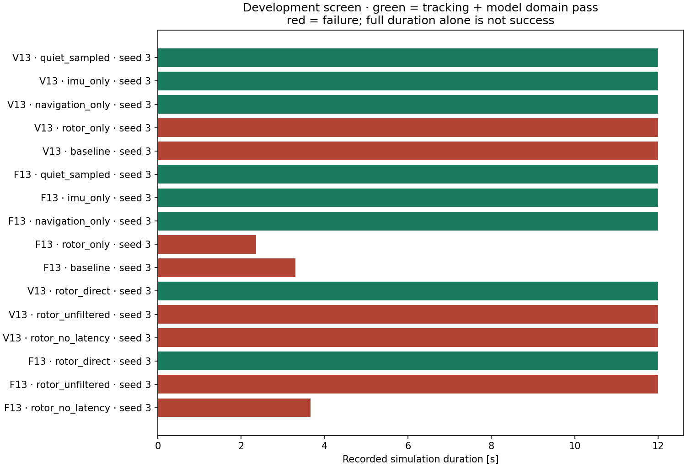

# Sensor feedback group comparisons

**Development diagnosis; not final tuning, hardware specifications, or paper results.**

Each variant uses the same plant and unchanged controller defaults. `quiet_sampled` removes generated sensor noise, biases, dropouts and transport latency, and uses a near-instant rotor measurement filter. `imu_only`, `navigation_only`, and `rotor_only` restore the corresponding nominal group. `baseline` restores all groups. Sampling rates, sensor clipping, estimator type, initial-state policy, navigation measurement covariances, process-noise assumptions and preflight covariance stay fixed. The quiet controls deliberately overestimate sensor uncertainty; they are diagnostic controls, not claims of perfectly accurate state estimation. No controller receives truth-state feedback. The optional timing conditions keep all nominal sensor errors: `rotor_unfiltered` removes only extra telemetry smoothing (tau = 1 microsecond), `rotor_no_latency` removes only telemetry transport latency, and `rotor_direct` removes both. Neither changes physical motor lag.

All outcomes, including early stops and timeouts, are retained. RMSE on a stopped run covers only its recorded prefix and is not directly comparable with full-duration RMSE. These runs do not estimate failure probabilities or a maximum usable sensor specification.

| Controller | Variant | Seed | Duration [s] | Tracking | Model domain | z RMSE [m] | v RMSE [m/s] | Solver failures |
|---|---|---:|---:|---|---|---:|---:|---:|
| V13 | quiet_sampled | 3 | 12.000 | True | True | 0.017 | 0.329 | 0 |
| V13 | imu_only | 3 | 12.000 | True | True | 0.021 | 0.325 | 0 |
| V13 | navigation_only | 3 | 12.000 | True | True | 0.067 | 0.326 | 0 |
| V13 | rotor_only | 3 | 12.000 | False | False | 3.997 | 27.511 | 0 |
| V13 | baseline | 3 | 12.000 | False | False | 10.635 | 34.869 | 9 |
| F13 | quiet_sampled | 3 | 12.000 | True | True | 0.018 | 0.334 | 0 |
| F13 | imu_only | 3 | 12.000 | True | True | 0.022 | 0.328 | 0 |
| F13 | navigation_only | 3 | 12.000 | True | True | 0.068 | 0.329 | 0 |
| F13 | rotor_only | 3 | 2.360 | False | False | 0.632 | 5.911 | 8 |
| F13 | baseline | 3 | 3.300 | False | False | 1.055 | 9.890 | 19 |
| V13 | rotor_direct | 3 | 12.000 | True | True | 0.070 | 0.337 | 0 |
| V13 | rotor_unfiltered | 3 | 12.000 | False | False | 3.985 | 27.151 | 0 |
| V13 | rotor_no_latency | 3 | 12.000 | False | False | 3.891 | 27.235 | 1 |
| F13 | rotor_direct | 3 | 12.000 | True | True | 0.071 | 0.333 | 0 |
| F13 | rotor_unfiltered | 3 | 12.000 | False | False | 0.496 | 2.291 | 6 |
| F13 | rotor_no_latency | 3 | 3.660 | False | False | 0.693 | 6.953 | 19 |

The delayed-telemetry cases start the rotor observer without an available measurement. The startup diagnostics record allocations made before first telemetry arrival. Thus latency comparisons include startup availability as well as in-flight delay; they cannot establish an ESC latency tolerance by themselves.

Raw traces remain in the local checkout at the relative paths in `outcomes.json`. The JSON includes exact experiment contracts and runtime hashes. Reproduce each campaign with the axes in its contract, using a new output directory.

