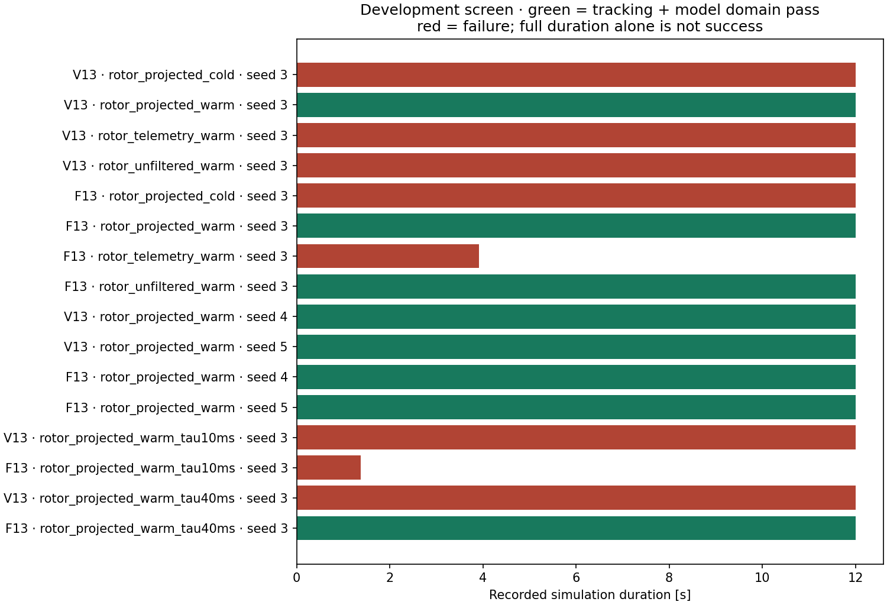

# Sensor feedback group comparisons

**Development diagnosis; not final tuning, hardware specifications, or paper results.**

Each variant uses the same plant and unchanged controller defaults. `quiet_sampled` removes generated sensor noise, biases, dropouts and transport latency, and uses a near-instant rotor measurement filter. `imu_only`, `navigation_only`, and `rotor_only` restore the corresponding nominal group. `baseline` restores all groups. Sampling rates, sensor clipping, estimator type, initial-state policy, navigation measurement covariances, process-noise assumptions and preflight covariance stay fixed. The quiet controls deliberately overestimate sensor uncertainty; they are diagnostic controls, not claims of perfectly accurate state estimation. No controller receives truth-state feedback. The optional timing conditions keep all nominal sensor errors: `rotor_unfiltered` removes only extra telemetry smoothing (tau = 1 microsecond), `rotor_no_latency` removes only telemetry transport latency, and `rotor_direct` removes both. Neither changes physical motor lag. `rotor_projected_*` uses a telemetry anchor at its sample time and recorded commands to predict the present rotor state, retaining nominal sensor noise and 4 ms latency. `warm` conditions replay 0.1 s of noisy steady-trim rotor prehistory; `cold` conditions start with no arrived rotor measurement. `rotor_telemetry_warm` keeps the 20 ms measurement filter; `rotor_unfiltered_warm` uses 1 microsecond. Projected tau10ms/tau40ms conditions change only the declared observer motor time constant from its nominal 20 ms.

All outcomes, including early stops and timeouts, are retained. RMSE on a stopped run covers only its recorded prefix and is not directly comparable with full-duration RMSE. These runs do not estimate failure probabilities or a maximum usable sensor specification.

| Controller | Variant | Seed | Duration [s] | Tracking | Model domain | z RMSE [m] | v RMSE [m/s] | Solver failures |
|---|---|---:|---:|---|---|---:|---:|---:|
| V13 | rotor_projected_cold | 3 | 12.000 | True | False | 0.070 | 0.333 | 0 |
| V13 | rotor_projected_warm | 3 | 12.000 | True | True | 0.070 | 0.337 | 0 |
| V13 | rotor_telemetry_warm | 3 | 12.000 | False | False | 4.302 | 25.947 | 0 |
| V13 | rotor_unfiltered_warm | 3 | 12.000 | False | False | 10.415 | 28.939 | 7 |
| F13 | rotor_projected_cold | 3 | 12.000 | False | False | 0.443 | 2.485 | 6 |
| F13 | rotor_projected_warm | 3 | 12.000 | True | True | 0.071 | 0.333 | 0 |
| F13 | rotor_telemetry_warm | 3 | 3.920 | False | False | 0.685 | 6.505 | 16 |
| F13 | rotor_unfiltered_warm | 3 | 12.000 | True | True | 0.071 | 0.336 | 1 |
| V13 | rotor_projected_warm | 4 | 12.000 | True | True | 0.035 | 0.348 | 0 |
| V13 | rotor_projected_warm | 5 | 12.000 | True | True | 0.054 | 0.356 | 0 |
| F13 | rotor_projected_warm | 4 | 12.000 | True | True | 0.036 | 0.345 | 1 |
| F13 | rotor_projected_warm | 5 | 12.000 | True | True | 0.055 | 0.356 | 0 |
| V13 | rotor_projected_warm_tau10ms | 3 | 12.000 | True | False | 0.070 | 0.328 | 0 |
| F13 | rotor_projected_warm_tau10ms | 3 | 1.380 | False | False | 0.560 | 5.065 | 6 |
| V13 | rotor_projected_warm_tau40ms | 3 | 12.000 | False | False | 0.084 | 0.409 | 0 |
| F13 | rotor_projected_warm_tau40ms | 3 | 12.000 | True | True | 0.071 | 0.334 | 2 |

Cold delayed-telemetry cases start without an available measurement; warm cases use an explicit steady-trim measurement/command prehistory. This is not a simulation of a complete takeoff or real preflight procedure. Startup diagnostics record allocations made before first telemetry arrival. Compare warm/cold and observer changes separately before interpreting any ESC latency tolerance.

Raw traces remain in the local checkout at the relative paths in `outcomes.json`. The JSON includes exact experiment contracts and runtime hashes. Reproduce each campaign with the axes in its contract, using a new output directory.

