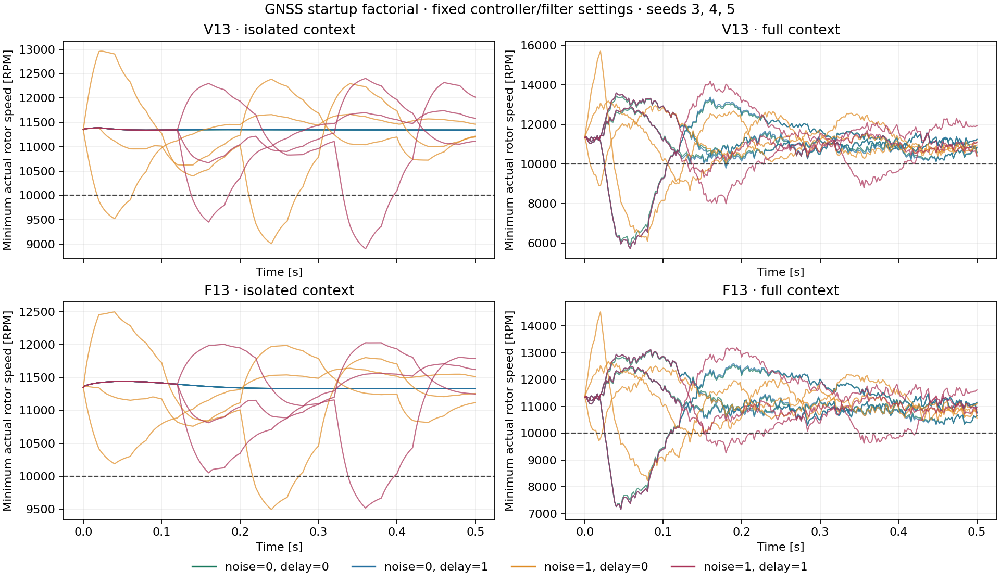

# Completed controller integration and GNSS startup study — v12

**Development evidence under fixed team gains and declared engineering sensor
assumptions. Final tuning and held-out paper experiments have not started.**

All **93 planned tasks completed their full 12 seconds**, with no execution
errors, timeouts, missing traces or pending cases. There are 56 full passes,
34 propeller-model-domain failures and three pre-gust settling failures.
Tracking passes in 90/93 records; model-domain validity passes in 59/93.
These task counts include deterministic controls and deliberate repeat checks;
they are not a pooled reliability estimate.

## Controller integration: 45 tasks

All 18 truth/quiet-sampled controls pass. The table shows the three nominal
sensor seeds (3, 4, 5) at each controller/speed. CPID is evaluated only at 20 m/s,
as required by the inherited design region.

| Controller | Speed [m/s] | Tracking / domain / full passes out of 3 |
|---|---:|---|
| V13 | 20 | 3 / 0 / 0 |
| V13 | 85 | 3 / 3 / 3 |
| F13 | 20 | 3 / 0 / 0 |
| F13 | 85 | 3 / 3 / 3 |
| M17 | 20 | 3 / 0 / 0 |
| M17 | 85 | 1 / 3 / 1 |
| GSLQR | 20 | 3 / 2 / 2 |
| GSLQR | 85 | 2 / 3 / 2 |
| CPID | 20 | 3 / 3 / 3 |

The integration stage has 32 full passes, 10 domain failures and three settling
failures. M17 seeds 3/5 and GSLQR seed 5 miss pre-gust settling at 85 m/s; their
simulations remain finite and complete. M17's peak velocity errors in the
2.5–3.0 s pre-gust window are 0.688 and 1.110 m/s, against the unchanged 0.5 m/s
criterion. Its passing noisy seed reaches 0.438 m/s. See the
[window details](m17_settling_details.json).

F13 at 85 m/s, nominal seed 4, has one non-accepted optimizer update at 6.52 s
(`Maximum_Iterations_Exceeded`, 30 iterations) out of 600 calls. The trial
continues and passes tracking/domain checks. Every other trial in this entire
study has zero recorded optimizer failures. This isolated event is retained;
it is not an execution failure or an early termination.

## GNSS factorial: 48 additional tasks

All 48 pass tracking; 24 also stay inside the propeller-model domain. Each cell
below contains three development seeds. Noise is either zero or the nominal
per-axis sigmas (0.8 m position, 0.15 m/s velocity); delay is either zero or
120 ms. GNSS remains at 10 Hz, with estimator Q/R/initial P held fixed.

| Controller / context | Noise 0, delay 0 | Noise 0, delay 120 ms | Nominal noise, delay 0 | Nominal noise, delay 120 ms |
|---|---:|---:|---:|---:|
| V13 / isolated | 3 | 3 | 1 | 1 |
| V13 / full | 1 | 1 | 0 | 0 |
| F13 / isolated | 3 | 3 | 2 | 2 |
| F13 / full | 2 | 2 | 0 | 0 |

Entries are **domain/full passes out of three**, not probability estimates.
Quiet repeated trajectories are identical within their cells. In the isolated
context, other sensor errors are removed and the quiet rotor policy is used;
the full context retains the other nominal sensors and timestamped rotor
observer. Their difference bundles multiple changes, so compare the noise and
delay axes within each context.

The results do not support assigning the low-speed problem to latency alone.
Quiet isolated delayed GNSS passes, while noisy zero-delay GNSS can fail.
Full-context failures also occur with GNSS noise removed. Equal pass counts
across delay settings do **not** mean equal trajectories or no timing effect:
the startup plot shows substantially different transients. For nominal seed 4,
the first V13/F13 domain crossing occurs at 0.026 s, before the first delayed
GNSS packet is processed at 0.120 s.

The panels have different vertical ranges; read their numerical axes. Every
curve is the minimum of four actual rotor speeds on one recorded trajectory.
All reconstructed domain exits in this study are below the assumed 10,000 RPM
lower boundary; there are no above-maximum-RPM, advance-ratio or reverse-flow
domain flags. This is a limit of supported model use, not proof of a real crash.
Some excursions are small: F13 nominal low-speed seed 5 reaches about 9998 RPM;
GSLQR low-speed seed 4 reaches 9935.8 RPM at one sampled instant. Their original
failure verdicts remain unchanged, with continuous values available for review.
Acceptance includes the whole run; the plotted first 0.5 s is diagnostic only.

## Verification and reproducibility

- All 93 records were checked against frozen input configurations, 114 runtime
  source hashes, physical parameter hashes and reconstructed domain diagnostics.
- Guarded merge reused 21 identical shared records and added 48 GNSS records;
  it produced 93 unique task IDs. The snapshot is not additional evidence.
- All six full-nominal factorial trajectories and verdicts exactly match their
  corresponding serial integration trials, including failed outcomes.
- Three additional numerical reference replays pass and are trajectory-bit-identical
  to the recorded v9 reference; two ran concurrently. They are separate checks,
  not additional independent research samples.
- **36 distinct analysis/execution tests pass**, with no failures or skips.

Read the [verification index](verification.json),
[complete diagnostic report](final_analysis/report.md) and
[all trial records](final_analysis/validated/outcomes.json).
The scientific plan hash is
`d2a72c0c060e99ed776037660919c2034fd47b6451982834c09c8c65fc6d3b19`.
Runtime source is unchanged from `4d30e025679c56b3acb72edb112d67c706b2cbeb`.
Raw campaigns remain in the Desktop checkout; the Git summaries do not contain
bulk traces. Timing includes overlapping local work and is not a fair hardware
or controller-speed benchmark. The separate source-portability work has its
own references and test evidence and is not pooled into this study.

## What must be settled before final tuning

The inherited tuning failure rule is `stop_reason or paper_failed`. All 37
failed acceptance cases here avoid that **binary failure penalty**, although
their ordinary RMSE cost still applies. Domain validity and pre-gust settling
are distinct from the inherited paper-failure criteria. Declare which criteria
govern the sensor-inclusive objective and supported operating region before
freezing final tuning; this study changes neither thresholds nor gains.

Next select and test explicit initialization, estimator-matching and controller-
interface variants on development seeds, then validate the broader maneuver,
sensor-fault and actuator-mismatch envelope. Freeze the engineering sensor
assumptions (or supply hardware calibration for device-specific claims), matching
comparisons, equal tuning budget and held-out analysis/sample-size rules.
Native Windows numerical/tuning-record and worker checks remain separate gates.
Three development seeds cannot establish a hardware sensor requirement or a
reliable failure-probability boundary. See the [paper protocol](../../docs/SENSOR_PAPER_PROTOCOL.md).
